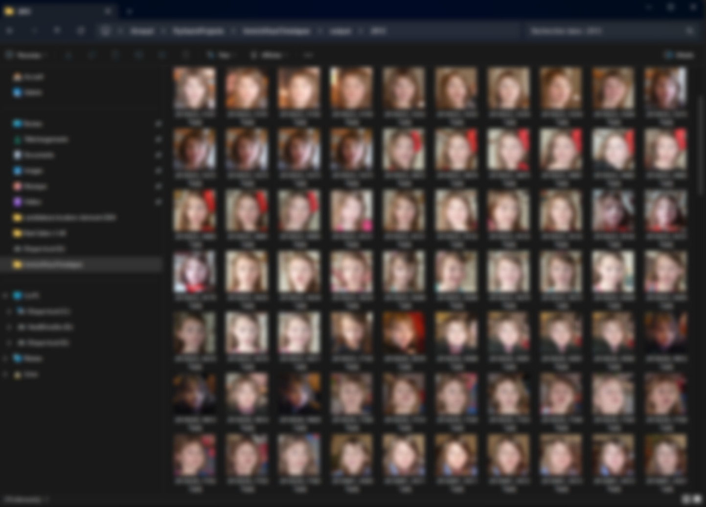

# Immich Selfie Timelapse Tool

This tool helps create selfie timelapses from your Immich instance.  
It uses the powerful machine learning features of Immich to gather all the photographs where a particular individual appears, retrieves the bounding box metadata, and automatically crops and aligns the photos.

  

  

## Features

- Automatically fetch images featuring a specified individual from your Immich instance.
- Extract bounding box metadata and crop/align photos using machine learning.
- Discard photos with low resolution (set by threshold).
- Discard photos where the subject is viewed from the side.
- Adds timestamp in the filename for easy chronological ordering.

## Setup

1. **Generate an API Key in Immich:**
   - Log in to your Immich web UI.
   - Navigate to the API settings (or your profile settings) and generate an API key.
   - Copy the API key for use with the script.

2. **Find the Person ID:**
   - In the Immich web UI, view photos sorted by person.
   - When you click on a specific person, check the URL in your browser.
   - The person ID (usually a UUID) is part of the URL. Copy this ID for use in the script.

3. **Install Dlib python library**
   - Download the wheel for your python version here: https://github.com/z-mahmud22/Dlib_Windows_Python3.x
   - Install it with `python -m pip install dlib-19.24.99-cp312-cp312-win_amd64.whl`

5. **Download the face detection CNN model**
   - Download mmod_human_face_detector.dat from:
     https://github.com/justadudewhohacks/face-recognition.js-models/blob/master/models/mmod_human_face_detector.dat
   - Place the file in the same folder as the script, or update the predictor path in the script accordingly.

4. **Download the Face Landmark Data:**
   - Download the 68-point face landmark model from:
     https://github.com/italojs/facial-landmarks-recognition/blob/master/shape_predictor_68_face_landmarks.dat
   - Place the file in the same folder as the script, or update the predictor path in the script accordingly.

5. **Install the required python modules from requirements.txt**
   - Note that an old version of Numpy is required for compatibility with dlib.

## Usage

Run the script from the command line with the required arguments. For example:

    python process_faces.py \
      --api-key YOUR_API_KEY \
      --base-url http://your.immich.server:2283/api \
      --person-id YOUR_PERSON_ID \
      --output-folder output

### Command-line Arguments

- **--api-key**: API key generated from Immich.
- **--base-url**: Base URL of your Immich API (e.g., http://192.168.1.123:2283/api).
- **--person-id**: The ID of the person (obtained from the Immich web UI).
- **--output-folder**: Directory where the aligned face images will be saved (default: output).
- **--padding-percent**: Padding added around the face as a percentage (default: 0.3).
- **--resize-width** and **--resize-height**: Dimensions for the output image (default: 512 x 512).
- **--min-face-width** and **--min-face-height**: Minimum acceptable face dimensions (default: 128 x 128).
- **--pose-threshold**: Threshold for acceptable head pose.
- **--desired-left-eye**: Desired left eye position as a fraction (x y) in the output image (default: 0.35 0.45).
- **--max-workers**: Number of parallel processes to use (default: 4).
- **--face-detect-model-paths**: Path to the CNN face detector model file (default: mmod_human_face_detector.dat).
- **--landmark-model-path**: Path to the face landmark predictor model file (default: shape_predictor_68_face_landmarks.dat).

## Additional Notes

- Ensure that the `shape_predictor_68_face_landmarks.dat` file is accessible by the script. Update the path if necessary.
- The tool may require some manual sorting of the output images to achieve the best video effect. In particular, the face landmark detection is not super robust.
- Execution speed: on my i5 11400, it can process about 2 image per second.
- I find that a video framerate of 15 fps gives good results.
- Contributions and improvements are welcome.

## License

This project is open source and available under the MIT License.