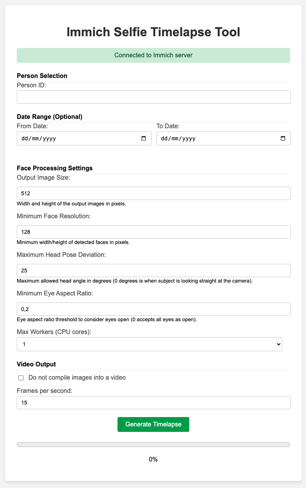

# Immich Selfie Timelapse Tool

This tool helps create selfie timelapses from your Immich instance.  
It uses the powerful machine learning features of Immich to gather all the photographs where a particular individual appears, retrieves the bounding box metadata, and automatically crops and aligns the photos.

<p align="center">
  
</p>

<p align="center">
  
</p>


## Features

- Automatically fetch images featuring a specified individual from your Immich instance.
- Extract bounding box metadata and crop/align photos using machine learning.
- Discard photos with low resolution (set by threshold).
- Discard photos where the subject is viewed from the side.
- Adds timestamp in the filename for easy chronological ordering.

## Docker compose setup

```yml
services:
  immich-selfie-timelapse:
    image: arnaudcayrol/immich-selfie-timelapse
    container_name: immich-selfie-timelapse
    ports:
      - "5000:5000"
    volumes:
      - ./immich_selfie_timelapse:/app/output
    environment:
      - IMMICH_API_KEY=abcdefghijklmnopqrstuvwxyz
      - IMMICH_BASE_URL=http://192.168.1.94:2283/api
```

Once the service is started, access the webpage to configure the tool: http://127.0.0.1:5000.  

<p align="center">
  
</p>

## Additional Notes

- For best looking results, I still recommand a manual pass over the final image folder to remove some outliers. The face orientation detection is not perfect at all. Hopefully someday I can get a better results.
- Contributions and improvements are welcome.

## License

This project is open source and available under the MIT License.